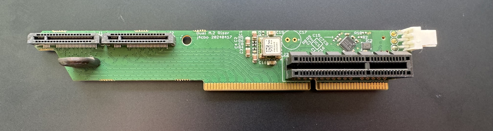
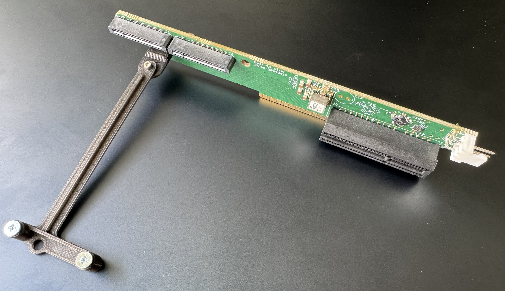
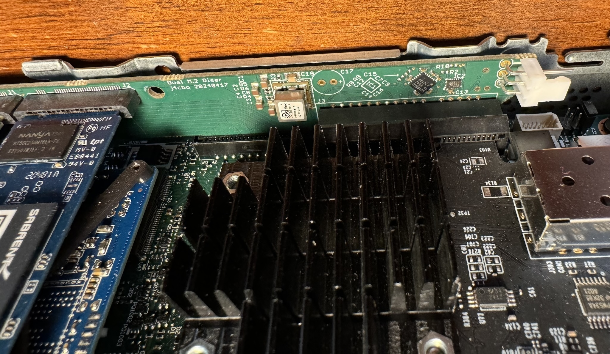
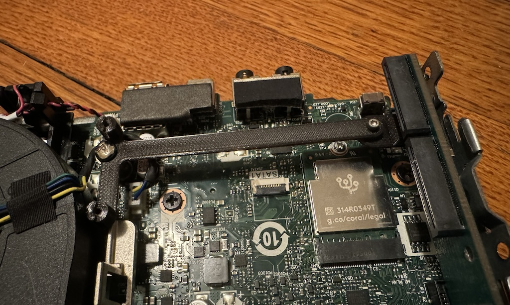

# Tiny5 M.2 Riser

This is a project I've been working on to create a custom riser board for Lenovo Tiny5
series (M720q/M920q/M920x, etc) to support an additional two M.2 SSDs as well as a 10G Ethernet card.
It builds on badger707's excellent work investigating [PCIe bifurcation](https://github.com/badger707/m920q-pcie-bifurcation/)
and adding a [second M.2 slot](https://github.com/badger707/m920q-dual-NVME/) to these systems.

Fully loaded with this riser, an M920x can support four M.2 2280 M-key SSDs, as well as an additional PCI card,
a SATA boot SSD, and an M.2 2230 E-key module. It also provides a standard 12 volt fan header.

Block diagram:

According to the IQ3X0IL board schematics, the system +3V3 rail is rated for 9.74 amps, and is used for
various onboard components as well. A typical M.2 SSD is specified for 2.5 to 3.0 amps so four of them at
full load could exceed the power supply capacity. The riser board therefore uses a buck converter from
the +12V rail to avoid overloading the system +3V3 supply.

In addition to the power supply and clock buffer, a custom-programmed GreenPAK is used to handle
power sequencing and ancillary PCIe signals like PERST# and CLKREQ#.

As of 5/14/2024, I have a production batch of these and am now selling them, see issue #1.

Using this **requires soldering** two 0402 resistors on the motherboard to enable PCIe bifurcation.

## Mounting Bracket

There is also a mounting bracket to hold the additional M.2 drives in place. It replaces the WiFi antenna
support at the front of the case.

## Disclaimer

This design is EXPERIMENTAL and provided WITHOUT WARRANTY. It has not been approved by Lenovo, the
FCC, or really anybody. I am not responsible if it breaks your computer, deletes your data, burns
down your house, or kicks your cat.
