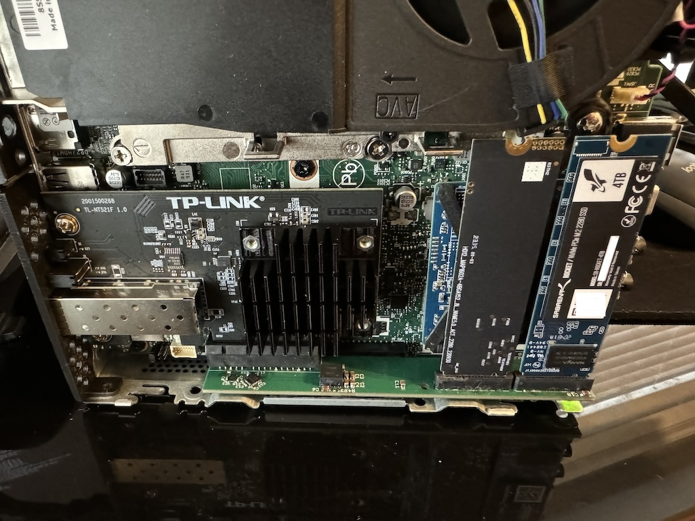
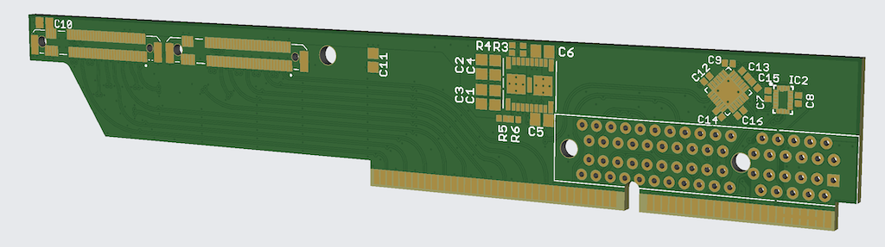
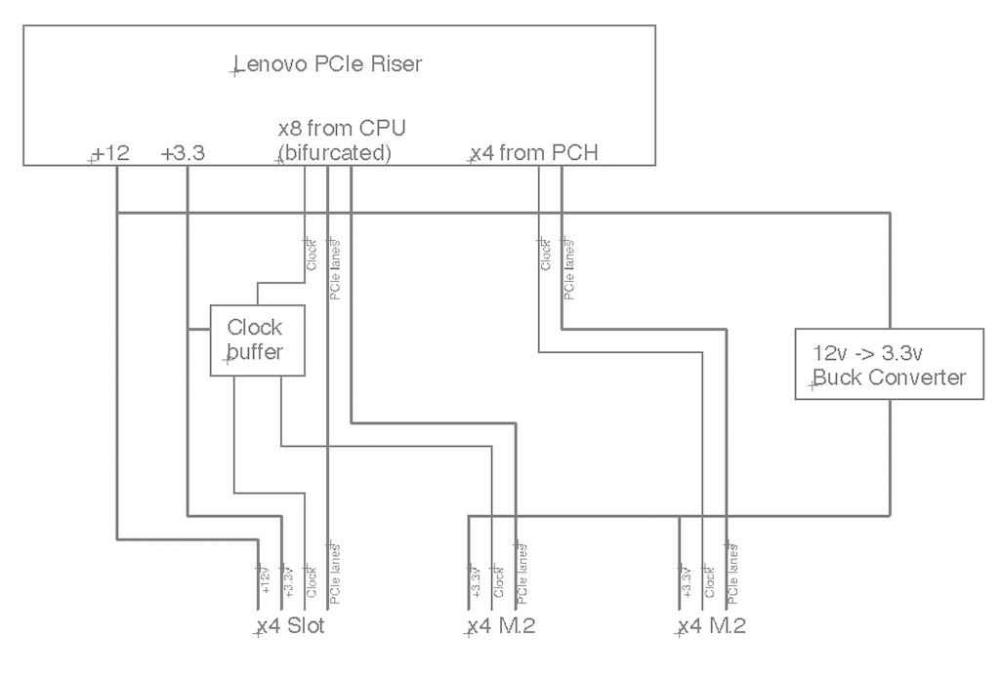

# Tiny5 M.2 Riser

This is a project I've been working on to create a custom riser board for Lenovo Tiny5
series (M720q/M920q/M920x, etc) to support an additional two M.2 SSDs as well as a 10G Ethernet card.
It builds on badger707's excellent work investigating [PCIe bifurcation](https://github.com/badger707/m920q-pcie-bifurcation/)
and adding a [second M.2 slot](https://github.com/badger707/m920q-dual-NVME/) to these systems.

Fully loaded with this riser, an M920x can support four M.2 2280 M-key SSDs, as well as an additional PCI card,
a SATA boot SSD, and an M.2 2230 E-key module.

First prototype:

Rendering of first prototype:

Block diagram:

In addition to the power supply and clock buffer, a custom-programmed GreenPAK is used to handle
power sequencing and ancillary PCIe signals like PERST# and CLKREQ#.

The first prototype is functional and in use in my M920q. As of 4/5/2024, I've ordered a second
prototype that fixes various issues with the first one, and will post updates once it's in hand.
After that, if there's sufficient interest, I'll look at producing a batch to sell.

## Disclaimer

This design is EXPERIMENTAL and provided WITHOUT WARRANTY. It has not been approved by Lenovo, the
FCC, or really anybody. I am not responsible if it breaks your computer, deletes your data, burns
down your house, or kicks your cat.
