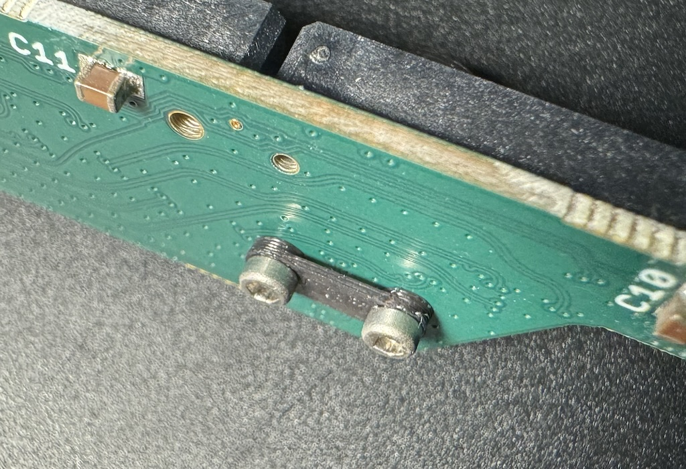
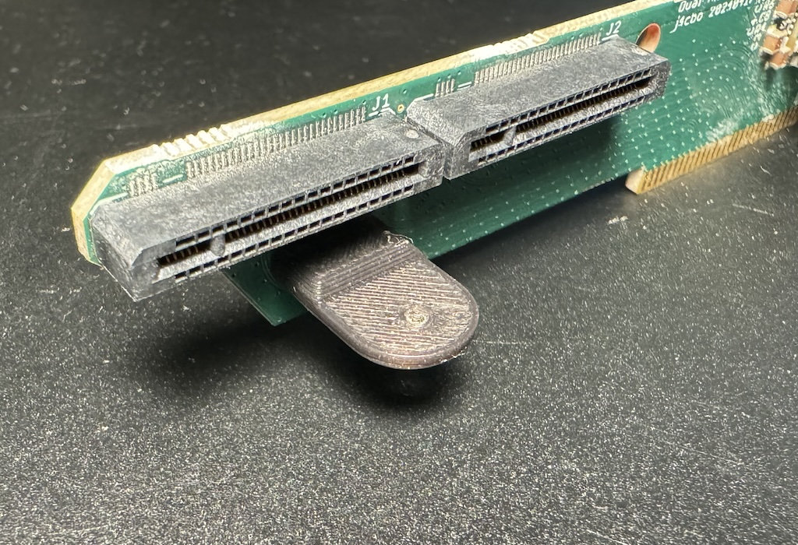
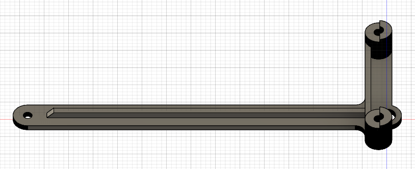
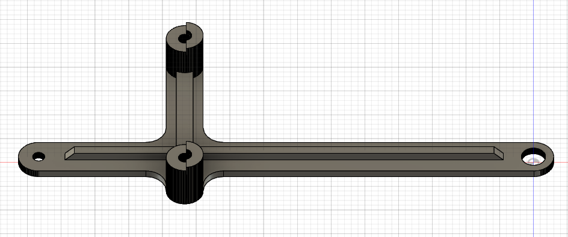
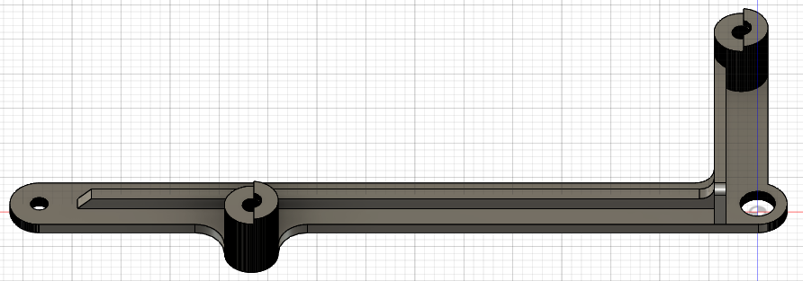
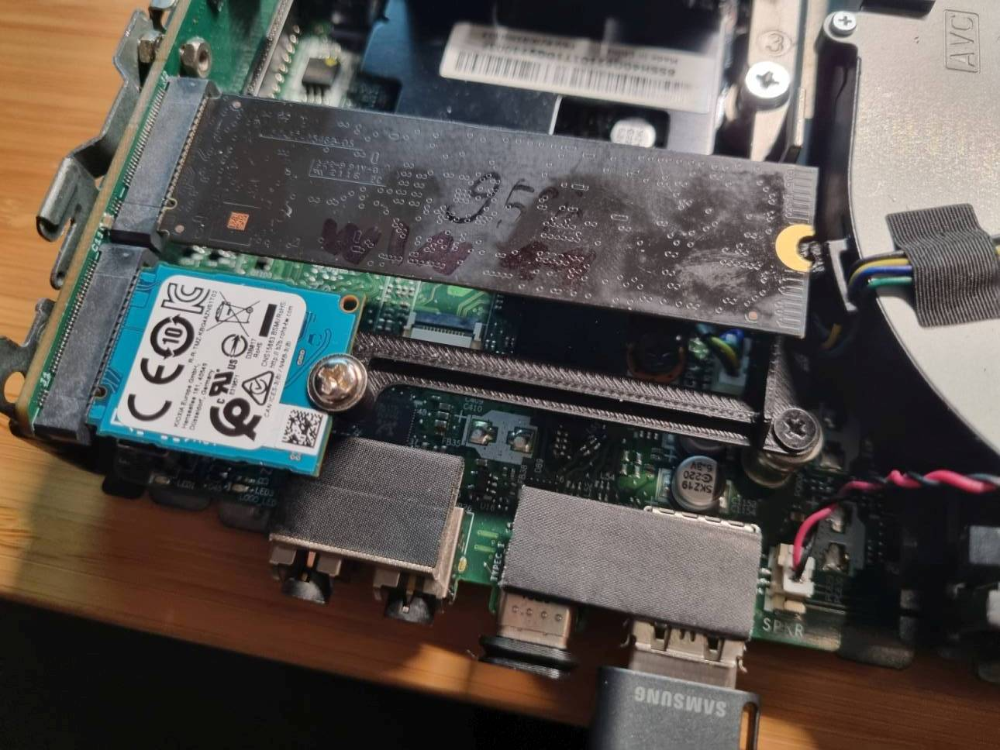

These are the STL files for the dual M.2 riser. They can also be [exported directly from OnShape](https://cad.onshape.com/documents/99f2719df4fededdfde5e0b6/w/fa3fefc0be67ea79d0f2b093/e/995a9ee69cf62af61cb02c70?renderMode=0&uiState=6643f7436819540134045a69).

You will also need:
- Three M1.6 x 5mm screws
- Two M2 x 2.5mm screws, with large flat heads suitable for securing the M.2 SSDs

To assemble the risers:

1. Print one copy of each file (`m2-mount` [see options below], `pcb-angle`, `spacer`). I use PLA with the default PrusaSlicer settings, 0.1 mm layer height for `spacer` and 0.2mm for the other files.
2. Use an M1.6 screw to "pre-tap" each of the three holes in the pcb-angle part. This will make the rest of assembly much easier.
3. Using the `spacer` on the back of the PCB with the bridge portion away from the PCB, assemble `spacer` and `pcb-angle` as shown. It is important that the screw heads not come directly into contact with the PCB, because there are signal traces very close to the holes.
   
   
5. Attach `m2-mount` to the flat portion of `pcb-angle`.
   
5. Remove the internal WiFi bracket from your M920q and install the riser board assembly. Use the existing standoff and screw to retain the opposite end of the `pcb-angle` part.
6. Install the SSDs and PCIe card. Enjoy your extra storage!

### Mount Options

| STL-File | Option | Image |
| --- | --- | --- |
|`m2-mount`|2280 + 2280||
|`m2-mount_2x2230`|2230 + 2230||
|`m2-mount_2230_2280`|2280 + 2230||

**Example 2230+2280**
